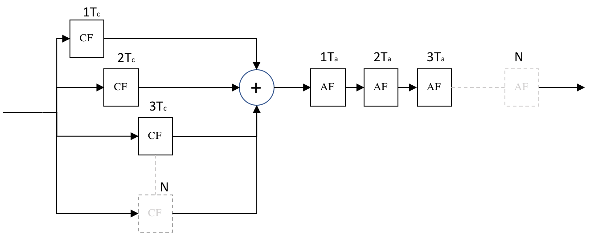

# zpoSchrodVerb
Flexible schroeder reverberator with 'slightly' or 'strongly' harmonic character as desired.

Delay times are deliberately harmonically related with a multipler such that a *slightly* harmonic or *strongly* harmonic character can be configured as desired.

## What does it sound like?

Audio demos in mono 48KHz 16bit WAV format are [provided](./doc/). 
- [shrodverb_1.wav](../../raw/main/doc/schrodverb_1.wav)
- [shrodverb_2.wav](../../raw/main/doc/schrodverb_2.wav)
- [shrodverb_3.wav](../../raw/main/doc/schrodverb_3.wav)
- [shrodverb_4.wav](../../raw/main/doc/schrodverb_4.wav)

## How do I use this thing?

Allpass `[AP]` and comb `[CF]` parameters are seperatly configurable.
Parameter `time` sets the shortest delay time.
Parameter `spread` allows deviation from integer multipliers.
Parameter `feedback` controls resonance and has an effect on overall reverb time.
Parameter `seed` influences random number generator state for behaviour store-and-recall.

Automation is a creative opportunity for some 'the room is shrinking' bonkers pitch sliding fun! 😎👍

## Anything else I should know?

Compatibility with Steinberg VST SDK v2.x is thoroughly tested, no IDE project nor SDK is provided.
